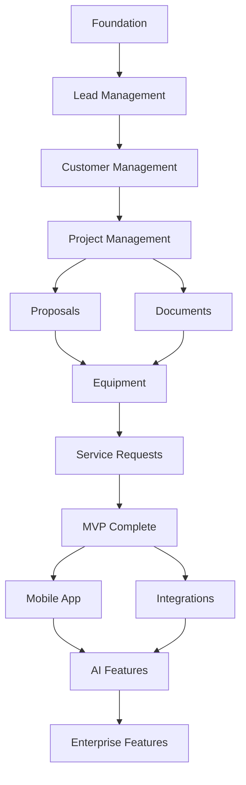

# SolarERP Project Roadmap & Execution Plan

## Executive Summary
This roadmap outlines the development trajectory for SolarERP from MVP to market-ready product, with clear milestones, deliverables, and risk mitigation strategies.

## Project Timeline Overview

```
Q1 2025 (Jan-Mar): MVP Development & Launch
Q2 2025 (Apr-Jun): Enhancement & Integration Phase
Q3 2025 (Jul-Sep): Mobile & Advanced Features
Q4 2025 (Oct-Dec): Scale & Enterprise Features
```

## Phase 1: MVP Development (Weeks 1-12)

### Week 1-2: Foundation Sprint
**Goal:** Establish rock-solid foundation

#### Deliverables
- [x] PostgreSQL migration completed
- [ ] CI/CD pipeline configured
- [ ] Monitoring infrastructure setup
- [ ] Security audit completed
- [ ] Development environment standardized

#### Success Criteria
- All developers can spin up local environment in < 10 minutes
- Automated tests run on every commit
- Zero critical security vulnerabilities
- Database performance baseline established

#### Demo Milestone
User can register, login, navigate dashboard with proper authorization

---

### Week 3-4: Lead Management Sprint
**Goal:** Complete lead lifecycle management

#### Deliverables
- [ ] Lead CRUD operations
- [ ] Lead status workflow
- [ ] Lead interaction tracking
- [ ] Lead assignment to sales reps
- [ ] Lead conversion to customer
- [ ] Basic lead analytics dashboard

#### Success Criteria
- Lead creation time < 30 seconds
- Lead search response < 100ms
- Conversion tracking accuracy 100%
- Mobile-responsive interface

#### Demo Milestone
Sales rep creates lead, logs interactions, converts to customer with full audit trail

---

### Week 5-6: Customer & Project Sprint
**Goal:** Establish customer-project relationship management

#### Deliverables
- [ ] Customer management interface
- [ ] Project creation and lifecycle
- [ ] Project stages and milestones
- [ ] Project-customer association
- [ ] Project timeline visualization
- [ ] Basic project dashboard

#### Success Criteria
- Support 100+ active projects
- Project status updates real-time
- Timeline accuracy within 1 day
- Zero orphaned projects

#### Demo Milestone
Create customer from lead, initiate project, track through installation stages

---

### Week 7-8: Proposal & Document Sprint
**Goal:** Enable proposal generation and document management

#### Deliverables
- [ ] Proposal builder interface
- [ ] Pricing calculator with ROI
- [ ] PDF proposal generation
- [ ] Document upload system
- [ ] Document versioning
- [ ] Secure document sharing

#### Success Criteria
- Proposal generation < 5 seconds
- PDF quality professional-grade
- Document upload supports 10MB files
- Version history maintained

#### Demo Milestone
Generate complete solar proposal with pricing, ROI, and system specifications as PDF

---

### Week 9-10: Equipment & Inventory Sprint
**Goal:** Implement inventory management system

#### Deliverables
- [ ] Equipment catalog management
- [ ] Inventory tracking system
- [ ] Low stock alerts
- [ ] Equipment compatibility matrix
- [ ] Supplier management
- [ ] Equipment allocation to projects

#### Success Criteria
- Real-time inventory updates
- Alert generation automated
- Support 1000+ SKUs
- Compatibility checks accurate

#### Demo Milestone
Track equipment from inventory through project allocation to installation

---

### Week 11-12: Polish & Launch Sprint
**Goal:** Production readiness and launch

#### Deliverables
- [ ] Performance optimization
- [ ] Security hardening
- [ ] User acceptance testing
- [ ] Production deployment
- [ ] Monitoring setup
- [ ] Documentation completion

#### Success Criteria
- 99.9% uptime achieved
- Page load < 2 seconds
- Zero critical bugs
- Documentation complete

#### Demo Milestone
Full workflow from lead to completed installation in production environment

## Phase 2: Enhancement & Integration (Weeks 13-24)

### Month 4: Core Enhancements
- Advanced reporting dashboard
- Automated email campaigns
- Customer portal (view-only)
- Bulk operations support
- Advanced search capabilities
- Data export functionality

### Month 5: Financial Integration
- QuickBooks integration
- Payment processing integration
- Commission calculation engine
- Financial reporting suite
- Invoice generation
- Payment tracking

### Month 6: Operational Excellence
- Service request automation
- Warranty tracking system
- Maintenance scheduling
- Customer satisfaction surveys
- Performance analytics
- Team productivity metrics

## Phase 3: Mobile & Advanced Features (Weeks 25-36)

### Month 7-8: Mobile Application
- React Native mobile app
- Offline capability
- Photo capture for site surveys
- GPS tracking for installers
- Push notifications
- Mobile-specific workflows

### Month 9: Intelligence Layer
- AI-powered lead scoring
- Predictive analytics
- Route optimization
- Demand forecasting
- Automated follow-ups
- Smart scheduling

## Phase 4: Scale & Enterprise (Weeks 37-48)

### Month 10-11: Enterprise Features
- Multi-company support
- Advanced role management
- White-labeling capability
- API platform for integrations
- Advanced security features
- Compliance reporting

### Month 12: Market Expansion
- Multi-language support
- Multi-currency handling
- Government subsidy integration
- Partner portal
- Marketplace for add-ons
- Community features

## Risk Assessment Matrix

### Critical Risks

| Risk | Probability | Impact | Mitigation Strategy | Owner |
|------|------------|--------|-------------------|--------|
| Database performance degradation | Medium | High | Implement caching, optimize queries, add indexes | Tech Lead |
| Security breach | Low | Critical | Security audits, penetration testing, training | Security Lead |
| Integration failures | Medium | High | Phased rollout, extensive testing, fallback plans | Integration Lead |
| User adoption resistance | Medium | High | Training program, intuitive UI, gradual rollout | Product Owner |
| Scope creep | High | Medium | Strict change control, clear requirements | Project Manager |

### Technical Risks

| Risk | Probability | Impact | Mitigation Strategy |
|------|------------|--------|-------------------|
| PostgreSQL migration issues | Low | High | Completed successfully, monitoring in place |
| Scalability bottlenecks | Medium | Medium | Load testing, horizontal scaling plan |
| Third-party API changes | Medium | Medium | Version locking, abstraction layers |
| Browser compatibility | Low | Low | Progressive enhancement, polyfills |
| Mobile app store rejection | Low | Medium | Follow guidelines, beta testing |

### Business Risks

| Risk | Probability | Impact | Mitigation Strategy |
|------|------------|--------|-------------------|
| Competitor feature parity | High | Medium | Rapid iteration, unique value props |
| Market timing | Medium | High | Phased release, early adopter program |
| Regulatory changes | Low | High | Legal review, flexible architecture |
| Key person dependency | Medium | High | Knowledge transfer, documentation |

## Key Performance Indicators (KPIs)

### Technical KPIs
- **System Uptime:** Target 99.9% (43 minutes downtime/month max)
- **Page Load Time:** Target < 2 seconds for 95th percentile
- **API Response Time:** Target < 200ms for 95th percentile
- **Error Rate:** Target < 0.1% of requests
- **Test Coverage:** Target > 70% code coverage
- **Deploy Frequency:** Target 2+ deployments/week

### Business KPIs
- **User Adoption:** 90% active users within 60 days
- **Lead Conversion:** 25% improvement in conversion rate
- **Project Completion:** 20% reduction in project timeline
- **Customer Satisfaction:** NPS score > 50
- **Feature Utilization:** 80% features used monthly
- **Support Tickets:** < 5 tickets per 100 users/month

### Growth KPIs
- **Month 3:** 10 active companies
- **Month 6:** 50 active companies
- **Month 9:** 150 active companies
- **Month 12:** 300 active companies

## Resource Requirements

### Team Composition

#### Core Team (Months 1-3)
- 1 Technical Lead
- 2 Backend Developers
- 2 Frontend Developers
- 1 QA Engineer
- 0.5 DevOps Engineer
- 1 Product Owner
- 0.5 UI/UX Designer

#### Expanded Team (Months 4-6)
- +1 Backend Developer
- +1 Mobile Developer
- +1 QA Engineer
- +0.5 DevOps Engineer

#### Scale Team (Months 7-12)
- +2 Full-stack Developers
- +1 Data Engineer
- +1 Security Engineer
- +1 Customer Success Manager

### Infrastructure Budget

| Period | Monthly Cost | Items |
|--------|-------------|-------|
| Months 1-3 | $500 | Basic cloud infrastructure, monitoring |
| Months 4-6 | $1,500 | Scaled infrastructure, integrations |
| Months 7-9 | $3,000 | Mobile infrastructure, AI services |
| Months 10-12 | $5,000 | Enterprise features, global CDN |

## Critical Path Dependencies



## Go-to-Market Strategy

### Soft Launch (Month 3)
- 5 beta customers
- Daily feedback cycles
- Rapid iteration on pain points
- Success story documentation

### Limited Release (Month 4)
- 20 early adopter customers
- Onboarding optimization
- Feature prioritization based on usage
- Case study development

### General Availability (Month 6)
- Public launch
- Marketing campaign
- Partnership announcements
- Conference presentations

### Scale Phase (Months 7-12)
- Channel partnerships
- Integration marketplace
- Customer referral program
- Industry certification

## Success Criteria for Project Completion

### MVP Success (Month 3)
- [ ] 10 active customers using system daily
- [ ] Zero critical bugs in production
- [ ] 95% feature completion
- [ ] Customer satisfaction > 4/5

### Phase 2 Success (Month 6)
- [ ] 50 active customers
- [ ] 3+ integrations operational
- [ ] 99.9% uptime achieved
- [ ] 25% lead conversion improvement demonstrated

### Phase 3 Success (Month 9)
- [ ] Mobile app in app stores
- [ ] 150 active customers
- [ ] AI features demonstrating ROI
- [ ] Industry recognition achieved

### Year 1 Success (Month 12)
- [ ] 300+ active customers
- [ ] $2M+ ARR
- [ ] Market leader in small-medium segment
- [ ] Platform profitability achieved

## Communication Plan

### Internal Communication
- **Daily:** Development team standups
- **Weekly:** Stakeholder status updates
- **Bi-weekly:** Sprint reviews and planning
- **Monthly:** Board/investor updates

### External Communication
- **Monthly:** Customer newsletter
- **Quarterly:** Feature announcements
- **Ad-hoc:** Security and maintenance notices

### Escalation Matrix

| Issue Type | Level 1 | Level 2 | Level 3 |
|------------|---------|---------|---------|
| Technical Bugs | QA Lead | Tech Lead | CTO |
| Security Issues | Security Lead | CTO | CEO |
| Customer Issues | Support | Customer Success | COO |
| Feature Requests | Product Owner | Product Manager | CPO |

## Contingency Plans

### Scenario: Critical Security Vulnerability
1. Immediate patch development (< 24 hours)
2. Customer notification within 48 hours
3. Full security audit within 1 week
4. Public disclosure per responsible disclosure

### Scenario: Major Performance Degradation
1. Rollback to previous version
2. Root cause analysis
3. Performance optimization sprint
4. Scaling infrastructure if needed

### Scenario: Key Integration Failure
1. Activate fallback mechanism
2. Customer notification with workaround
3. Vendor escalation
4. Alternative integration evaluation

### Scenario: Team Member Departure
1. Knowledge transfer session
2. Documentation review
3. Responsibility redistribution
4. Accelerated hiring process

## Review and Adjustment Schedule

- **Weekly:** Sprint progress review
- **Monthly:** Milestone assessment and adjustment
- **Quarterly:** Strategic direction review
- **Annually:** Complete roadmap revision

---

*This roadmap is a living document subject to adjustment based on market feedback, technical discoveries, and business priorities.*

*Last Updated: 2025-08-20*
*Next Review: 2025-09-01*
*Owner: Technical Architecture Team*