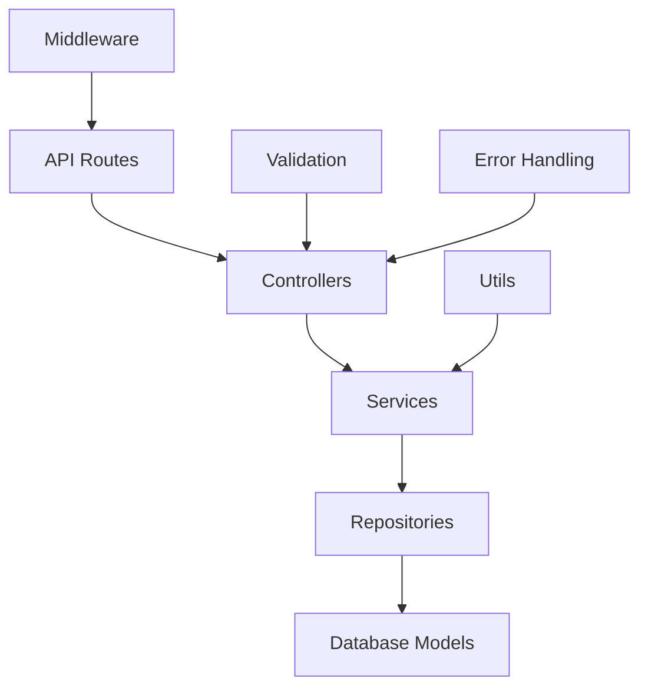
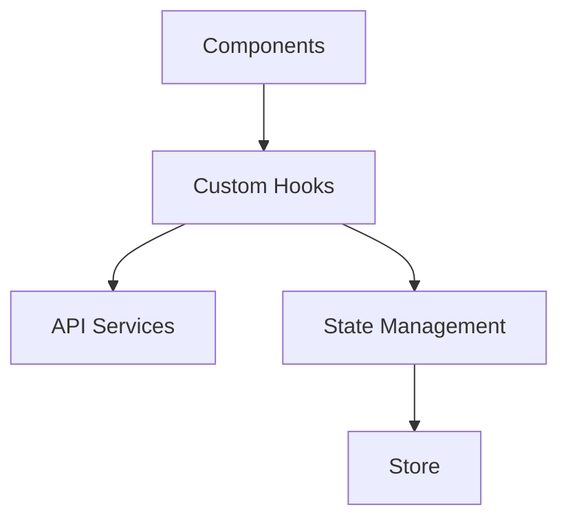
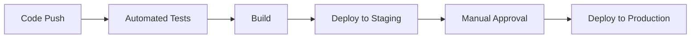

# Solar ERP Architecture Improvement Plan

## Current Architecture Overview

Based on analysis, the current architecture consists of:

1. **Backend**:
   - Node.js/Express.js REST API
   - MongoDB database with Mongoose ODM
   - Monolithic structure with routes, controllers, and models
   - JWT authentication
   - Basic error handling and middleware

2. **Frontend**:
   - React with TypeScript
   - Material UI component library
   - React Router for navigation
   - Context API for state management
   - Axios for API communication

3. **Deployment**:
   - Docker containerization
   - Railway deployment

## Proposed Architecture Improvements

### 1. Backend Architecture Improvements

#### 1.1 Adopt a Clean Architecture Pattern



**Implementation Plan:**

1. **Create a Service Layer**:
   - Move business logic from controllers to dedicated service modules
   - Controllers should only handle HTTP requests/responses
   - Services handle business logic and orchestration

2. **Implement Repository Pattern**:
   - Create repositories to abstract database operations
   - Makes it easier to switch databases or implement caching

3. **Standardize Error Handling**:
   - Create a consistent error handling system
   - Custom error classes for different error types
   - Global error handler middleware

4. **Improve Validation**:
   - Consistent validation across all endpoints
   - Separate validation schemas from route handlers

#### 1.2 Modularize Backend by Domain

Reorganize the backend structure by domain/feature rather than by technical role:

```
src/
├── modules/
│   ├── auth/
│   │   ├── auth.controller.js
│   │   ├── auth.service.js
│   │   ├── auth.repository.js
│   │   ├── auth.routes.js
│   │   ├── auth.validation.js
│   │   └── auth.model.js
│   ├── customers/
│   ├── projects/
│   ├── proposals/
│   └── ...
├── common/
│   ├── middleware/
│   ├── utils/
│   └── config/
└── server.js
```

#### 1.3 Implement API Versioning

```
/api/v1/auth/login
/api/v1/customers
```

This allows for future API changes without breaking existing clients.

#### 1.4 Add Comprehensive Documentation

- Add JSDoc comments to all functions and classes
- Generate API documentation using Swagger/OpenAPI
- Create README files for each module explaining its purpose and usage

#### 1.5 Improve Configuration Management

- Move all configuration to a centralized location
- Support different environments (dev, test, prod)
- Use environment variables with proper validation

### 2. Frontend Architecture Improvements

#### 2.1 Implement Feature-Based Structure

```
client-new/src/
├── features/
│   ├── auth/
│   │   ├── components/
│   │   ├── hooks/
│   │   ├── services/
│   │   ├── types/
│   │   └── utils/
│   ├── customers/
│   ├── projects/
│   └── ...
├── common/
│   ├── components/
│   ├── hooks/
│   ├── utils/
│   └── types/
└── app/
    ├── App.tsx
    ├── routes.tsx
    └── store.ts
```

#### 2.2 Improve State Management

- Consider using Redux Toolkit or React Query for more complex state management
- Implement custom hooks for reusable logic
- Separate UI state from application state



#### 2.3 Enhance Component Architecture

- Create a component library with consistent patterns
- Implement atomic design principles (atoms, molecules, organisms, templates, pages)
- Add storybook for component documentation and testing

#### 2.4 Improve API Integration

- Create a more robust API client with interceptors for:
  - Authentication
  - Error handling
  - Caching
  - Retry logic
- Implement a data fetching strategy (React Query, SWR)

#### 2.5 Add Comprehensive Testing

- Unit tests for utilities and hooks
- Component tests for UI components
- Integration tests for feature flows
- End-to-end tests for critical paths

### 3. DevOps and Infrastructure Improvements

#### 3.1 Implement CI/CD Pipeline



#### 3.2 Enhance Docker Configuration

- Multi-stage builds for smaller images
- Separate development and production configurations
- Health checks and graceful shutdown

#### 3.3 Implement Monitoring and Logging

- Add structured logging
- Implement application monitoring
- Set up error tracking

### 4. Security Improvements

#### 4.1 Enhance Authentication and Authorization

- Implement refresh tokens
- Add role-based access control
- Secure password reset flow

#### 4.2 Improve API Security

- Rate limiting for all endpoints
- Input validation and sanitization
- CSRF protection
- Security headers

## Implementation Roadmap

### Phase 1: Foundation Improvements (1-2 months)

1. Restructure backend with service layer
2. Implement consistent error handling
3. Reorganize frontend by features
4. Add comprehensive documentation

### Phase 2: Architecture Enhancements (2-3 months)

1. Implement repository pattern
2. Enhance state management
3. Improve component architecture
4. Add API versioning

### Phase 3: Advanced Improvements (3-4 months)

1. Implement CI/CD pipeline
2. Enhance security features
3. Add comprehensive testing
4. Set up monitoring and logging

## Benefits of the Proposed Architecture

1. **Improved Maintainability**:
   - Clear separation of concerns
   - Consistent patterns across the codebase
   - Better documentation

2. **Enhanced Developer Experience**:
   - Easier onboarding for new developers
   - More intuitive codebase organization
   - Better tooling and testing

3. **Future-Proofing**:
   - Modular architecture allows for easier updates
   - API versioning prevents breaking changes
   - Clean architecture makes it easier to adapt to new requirements

4. **Scalability**:
   - Better organization for growing codebase
   - Improved performance through caching and optimization
   - Foundation for potential microservices in the future

## Example Implementations

### Backend Service Layer Example

```javascript
// auth.service.js
const bcrypt = require('bcryptjs');
const jwt = require('jsonwebtoken');
const authRepository = require('./auth.repository');
const { AppError } = require('../../common/utils/errors');
const config = require('../../common/config');

class AuthService {
  async login(email, password) {
    // Get user from repository
    const user = await authRepository.findUserByEmail(email);
    
    if (!user) {
      throw new AppError('Invalid credentials', 401);
    }
    
    // Verify password
    const isPasswordValid = await bcrypt.compare(password, user.password);
    
    if (!isPasswordValid) {
      throw new AppError('Invalid credentials', 401);
    }
    
    // Generate token
    const token = this.generateToken(user._id);
    
    return { user, token };
  }
  
  generateToken(userId) {
    return jwt.sign({ id: userId }, config.jwt.secret, {
      expiresIn: config.jwt.expiresIn
    });
  }
  
  // Other auth methods...
}

module.exports = new AuthService();
```

### Frontend Feature Module Example

```typescript
// features/customers/hooks/useCustomers.ts
import { useState, useEffect } from 'react';
import { useQuery, useMutation, useQueryClient } from 'react-query';
import { customerService } from '../services/customerService';
import { Customer } from '../types';

export function useCustomers() {
  const queryClient = useQueryClient();
  
  // Get all customers
  const {
    data: customers,
    isLoading,
    error
  } = useQuery('customers', customerService.getCustomers);
  
  // Create customer mutation
  const createCustomer = useMutation(
    (newCustomer: Omit<Customer, 'id'>) => customerService.createCustomer(newCustomer),
    {
      onSuccess: () => {
        // Invalidate and refetch
        queryClient.invalidateQueries('customers');
      }
    }
  );
  
  // Other mutations and logic...
  
  return {
    customers,
    isLoading,
    error,
    createCustomer,
    // Other returned values...
  };
}
```

## Next Steps

1. Review this architecture plan with the development team
2. Prioritize improvements based on current pain points
3. Create a detailed implementation plan for Phase 1
4. Set up a proof of concept for the new architecture
5. Gradually migrate the existing codebase to the new architecture